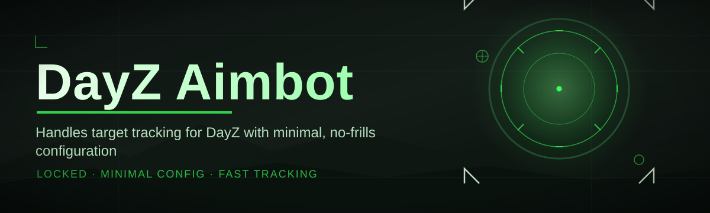
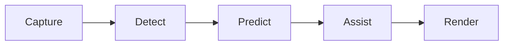

# dayz-aim-assistant 🎯🛡️

  

*Precision targeting assistance for DayZ, engineered by survivors who got tired of missing.*

  

## 🧭 Overview

Chernarus doesn't forgive shaky hands. A single missed shot on an infected horde or a rival survivor can cost you hours of looting, base-building, and progress — gone in a blink. **dayz-aim-assistant** was born out of that frustration: a small community of DayZ veterans who wanted consistent, fair, and configurable targeting support without duct-taping together abandoned scripts from forgotten forums.

This project is a standalone Windows utility purpose-built around the mechanics of DayZ — bullet drop, sway, server tick behavior, and the chaos of close-quarters PvP. It reads live screen data, calculates target vectors, and assists your aim with adjustable strength, smoothing, and FOV constraints. No memory injection, no server-side interference — just a responsive overlay-driven assistant that respects your setup.

Who is this for? Solo survivors tired of losing gunfights to input lag. Squad leads who want their newer members to hold their own. Streamers who want cleaner highlight reels. Whether you're defending a base at 3 AM or clearing a military compound solo, **dayz-aim-assistant** is built to feel like an extension of your own reflexes — not a crutch, a co-pilot.

---

## ⚡ What It Actually Does

> [!NOTE]
> Every capability below is tunable. Nothing is forced on you — you build your own profile.

- **Adaptive target tracking** — locks onto visible hitboxes with configurable priority (head, chest, nearest, threat-based).
- **Humanized smoothing curves** — motion interpolation modeled on real recoil recovery, not robotic snapping.
- **Dynamic FOV ring** — a visual, resizable capture radius so you control exactly how aggressive assistance feels.
- **Recoil-aware compensation** — accounts for DayZ's weapon-specific spray patterns across common rifles and SMGs.
- **Trigger-assist toggle** — optional semi-auto fire timing sync, fully separate from tracking logic.
- **Color & contour target detection** — works off visual data, adaptable to modded skins and custom servers.
- **Profile presets** — save distinct configs for PvP raids, PvE clearing, or sniper-range engagements.
- **Overlay HUD** — live readout of FOV, sensitivity, and active profile without alt-tabbing.
- **Low-footprint engine** — built for minimal CPU/GPU overhead so your frame times stay untouched.

> [!TIP]
> Start with the "PvE Clearing" preset if you're new — it's the gentlest curve and the best way to learn how the smoothing feels before tightening it up.

---

## 🚀 Getting Into the Field

1. Visit the landing page via the **Get Started** button above.
2. Download the latest standalone build — no bundled installers, no bloat.
3. Run the executable directly. Windows may flag unsigned `.exe` files — see Troubleshooting below.
4. Open the overlay with the default hotkey, pick a profile, and drop into your server.

> [!IMPORTANT]
> Run DayZ in **Borderless Windowed** mode. Exclusive fullscreen blocks overlay rendering on most GPU drivers.

---

## 🖥️ System Requirements

| Component | Minimum | Recommended |
|---|---|---|
| OS | Windows 10 (64-bit) | Windows 11 (64-bit) |
| CPU | Quad-core, 3.0GHz | 6-core, 3.5GHz+ |
| GPU | DirectX 11 capable | Dedicated GPU, 4GB+ VRAM |
| RAM | 8 GB | 16 GB |
| Dependencies | None | None |

  

No frameworks to install. No dependency chains. Download, run, done.

---

## 🔩 How It Works

The assistant operates as an independent overlay process that observes your screen output and computes assistance vectors in real time — it never touches DayZ's memory space.

1. **Capture** — a lightweight frame grabber samples your display region.
2. **Detect** — contour and color analysis isolates candidate targets within the active FOV ring.
3. **Predict** — the engine estimates target velocity and applies weapon-specific drop/recoil math.
4. **Assist** — smoothed input vectors are applied through your chosen curve and strength.
5. **Render** — the HUD reflects live state so you always know what's active.

---

## 🧩 Troubleshooting

<strong>The overlay doesn't appear over DayZ</strong>

Switch DayZ to Borderless Windowed mode. Exclusive fullscreen locks the render pipeline and prevents overlays from drawing.

<strong>Windows Defender flagged the download</strong>

Unsigned indie executables commonly trigger heuristic flags. Verify the file hash on the landing page before running if you want extra assurance.

<strong>Targeting feels jittery on high-refresh monitors</strong>

Increase the smoothing coefficient in Settings → Motion. Higher refresh rates need slightly higher smoothing to avoid visible micro-corrections.

<strong>FPS dropped after enabling detection</strong>

Lower the FOV ring radius. Detection cost scales with capture area — a smaller ring means fewer pixels to analyze per frame.

<strong>Hotkeys aren't responding</strong>

Some keyboard software (Razer Synapse, Logitech G Hub) intercepts global hotkeys. Disable conflicting macros or rebind in Settings → Keybinds.

> [!WARNING]
> Always check the current ruleset of your server community. Some communities have zero tolerance policies around assistance tools regardless of configuration — know before you join.

---

## 🎨 UI, Themes & Shortcuts

Interface design leans minimal — a translucent HUD panel that stays out of your line of sight until you need it.

- `INSERT` — toggle overlay visibility
- `PAGE UP / PAGE DOWN` — cycle FOV radius
- `F5` — swap active profile
- `F6` — toggle trigger-assist
- `CTRL + SHIFT + Q` — panic-hide everything instantly

**Themes:** Dark Slate (default), Chernarus Green, High-Contrast Amber — all adjustable via Settings → Appearance, including opacity and crosshair styling.

> [!TIP]
> Bind the panic-hide combo to something you can hit blind. Muscle memory beats menu-diving every time.

---

## 🤝 Contributing & Community

This project grows because survivors keep showing up. Bug reports, config presets, and detection tuning contributions are all welcome via Issues and Pull Requests.

- Open an issue for bugs, with your Windows build and GPU driver version.
- Submit PRs against `dev`, not `main`.
- Share your profile presets in Discussions — community-tuned configs are gold for newcomers.

> [!NOTE]
> No contribution is too small. Typo fixes in the docs matter just as much as detection improvements.

---

## 📜 License

Released under the [MIT License](LICENSE), 2026. Use it, fork it, build on it — just keep the license notice intact.

---

## ⚠️ Disclaimer

This tool is provided for educational and personal-use purposes on private or community servers that permit assistance software. Usage on official servers or platforms with explicit anti-assistance policies is at your own risk and discretion. The maintainers are not responsible for account or server-level consequences resulting from misuse. Play fair, respect your community's rules, and survive smart.

